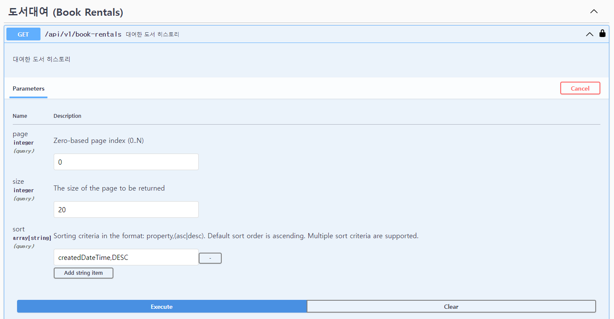

# 우리집은 도서관 백엔드 엔지니어 과제 (이관석)

## 🏠 Overview

**소감**

우리집은 도서관 백엔드 사전과제로 rest api를 개발하였습니다.
프로젝트를 만들면서 스스로에게 좋은 배움의 기회가 된 것 같습니다. 기회를 주셔서 감사드립니다. <br><br>

**요구사항 만족**

기술적인 부분도 중요하지만 제일 중요한건 요구사항에 맞게 올바르게 작동하는게 중요하다는 생각이 들었습니다.
그래서 기능 요구사항을 면밀히 검토하여 정상적으로 잘 작동하는 api를 만드는 것을 최우선으로 삼았습니다.
<br><br>

**가독성**

개인 프로젝트이지만 협업 프로젝트라고 여기고 변수명이나 메소드명, 클래스명등 명명 규칙을
가독성있고 이해하기 쉬운 이름을 붙이려고 노력하였습니다.
<br><br>

**인증**

spring security를 적용하였고 jwt로 사용자를 인증하는 방식으로 개발하였습니다. 회원가입 -> 로그인 후 응답으로 받은 token을 header에 Bearer 형식으로 담아서 사용합니다.
해당 토큰을 활용하여 jwtFilter에서 jwtProvider를 통해 파싱을 한 후 securityContextHolder에 Authentication을 담아 놓아서 인증이 필요한 곳에서 활용하게 하였습니다.<br> 
@Controller단에서 @AuthenticationPrincipal를 활용해 현재 접속 중인 사용자의 정보로 서비스 로직을 수행합니다.
<br><br>

**도서 반납 로직**

ConsignedBookReturnScheduler에서 스케쥴링을 하여 대여된 도서의 rentalStartDate가 현재 시간에서 10초를 뺀 시간 보다 더 이전인 BookRental을 일괄적으로 불러와 반납처리를 하도록 처리 하였습니다.

**멀티 모듈**

프로젝트 모듈을 core와 api로 나누어 느슨하게 결합되도록 의도하였습니다.
모듈형태로 해서 추후 확장성을 가져갈 수 있도록 하였습니다.
<br><br>

**예외 처리**

예외처리를 적절하게 하여 api에서 해당 예외에 맞는 응답을 줄 수 있도록 advice controller를 활용하였습니다. requestDto에 validation을 적극 도입하였습니다.
<br><br>

**데이터**

java진영의 ORM인 jpa를 사용하였습니다. 로컬에서는 docker로 mysql을 띄워서 사용하였지만 제출용으로는 h2를 사용하였습니다. <br><br>

**swagger**

swagger doc을 사용하여 api를 사용하기 쉽게 공개하였습니다.
어플리케이션을 구동시킨 이후 아래의 url로 접속하면 swagger를 사용할 수 있습니다.

swagger url: http://localhost:8080/swagger-ui/index.html

## 실행 순서
1. swagger 진입 http://localhost:8080/swagger-ui/index.html


2. 회원가입


3. 이메일로 로그인


4. 응답값으로 전해진 token 복사 후 swagger 화면 우측상단에 authorize에 붙여넣기 후 authorize 버튼 클릭


5. 도서 위탁하기


5. 위탁된 도서를 조회하여야 하지만 로직상 자기 자신이 등록한 도서는 본인에게는 조회되지 않도록 하였습니다. swagger 화면 우측 상단에 Authorize 버튼을 클릭하고 logout을 해줍니다.


6. 로그아웃을 한 후 다른 이메일로 회원가입 후 로그인을 한 후 마찬가지로 응답값으로 받은 토큰으로 swagger 우측 상단에 Authorize 버튼을 눌러 인증을 해줍니다.
<br><br>
7. 위탁된 도서 전체 조회를 합니다.


8. id로 도서를 대여합니다.


8. 대여한 도서 히스토리를 조회합니다. 스케쥴러가 정상적으로 돌면서 반납처리를 한 것이 확인됩니다.




## 🏛️ Structure

### Api (woodo-homework-api)

Domain

- Auth 
  - 회원가입, 로그인
- BookRental 
  - 도서 대여
  - ConsignedBook과 Member 사이의 중간 테이블
- ConsignedBook 
  - 위탁도서
- Member
  - 사용자

### Core (woodo-homework-core)

**DB 연관관계**

- BookRental
  - consignedBookId (위탁도서 id)
  - borrowerId (대여한 회원 id)
- ConsignedBook
  - consignorId (위탁 회원 id)
  - bookRentalList (대여된 히스토리)
- Member
  - consignedBookList (위탁한 책 list)
  - memberBookRentalList (대여한 책 히스토리)

## 🎢 Tech Stack

- java 17
- gradle 8.5
- spring boot 3.2.3
- spring security
- mysql 8
- h2
- jpa
- swagger
- lombok

## 🏃 Run Application

```shell
chmod +x start.sh
./start.sh
```